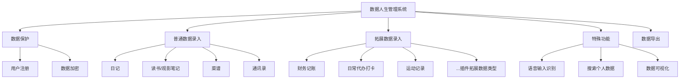

# 摘  要

本文旨在通过基于Nuxt与flutter的多端可拓展个人知识软件'云舒'的设计与实现，实现对个人数据的高效管理。目前同类应用难以全面满足用户有关保存用户隐私数据的各类需求。'云舒'就是旨在研究便捷保存个人隐私数据，并安全地在用户的各类终端上浏览并编辑个人数据的应用。 针对这些问题，采用 Next.js 、 Electron.js 、React Native 等技术，设计并实现了数据人生管理系统。前端页面采用基于 React 的Next.js框架，搭配 Tailwind CSS 构建，配合Electron与 React Native有效解决了客户端多端访问问题和页面性能问题。后端采用 Next.js作为中间件配合类型安全的tRPC后端与轻量级prisma ORM对sqlite3数据库进行交互，有效提高了开发效率。项目开放了用户导出个人数据库服务并对接了webdav协议，在方便用户管理个人隐私数据同时，也有效避免了数据同步繁琐复杂的问题。通过基于Next.js和Electron的数据人生管理系统的开发，不仅提高了数据管理的效率，而且还提供了更好的用户体验。该系统具有良好的实用性，也对于提高个人数据管理水平具有重要意义。


**关键词：个人数据；React；Next.js；Electron；React Native；

# Abstract

This paper aims to achieve efficient management of personal data by developing a data life management system based on Next.js and Electron. It is difficult for similar applications to fully satisfy the various needs of users regarding the preservation of their private data. Data Life Management System is an application that aims to study the convenience of storing personal data and securely browsing and editing personal data on various terminals of users. To address these issues, we designed and implemented Data Life Management System using technologies such as Next.js, Electron.js and React Native. The front-end page is built with Next.js framework based on React and Tailwind CSS, with Electron and React Native to effectively solve the problem of client-side multi-terminal access and page performance. The backend uses Next.js as middleware with type-safe tRPC backend and lightweight Prisma ORM to interact with sqlite3 database, effectively improving development efficiency. The project opened the user export personal database service and docked to the webdav protocol, which is convenient for users to manage personal privacy data and also effectively avoid the problem of cumbersome and complicated data synchronization. Through the development of data life management system based on Next.js and Electron, it not only improves the efficiency of data management, but also provides better user experience. The system has good practicality and is also important for improving personal data management.

**Key words: Personal Data；React；Next.js；Electron；React Native；**

# 第1章 文献综述

## 1.1 研究目的及意义

近年来，随着人们生活水平的提高，个人的数据数量也在不断增加，如何合理管理自己的数据成为了一个问题。本文旨在通过基于Next.js和Electron的数据人生管理系统的开发，实现对个人数据的高效管理。目前同类应用难以全面满足用户有关保存用户隐私数据的各类需求。 针对这些问题，采用 Next.js 、 Electron.js 、React Native 等技术，设计并实现了数据人生管理系统。数据人生管理系统是一个旨在安全地存储和管理个人数据的应用程序。它允许用户在多个设备上轻松浏览和编辑他们的个人数据。数据人生管理系统使用户能够安全地存储、管理和分享数据，并为用户提供对其数据和谁可以访问数据的控制。数据人生管理系统还提供诸如数据加密和数据访问控制等功能。数据人生管理系统可以用作存储如联系信息、个人日记、私房食谱、日常待办打卡、日常记账、跑步记录、读书/观影笔记、医疗记录，以及更多不同的个人数据的安全私人数据库，还可以使用画板/语音输入各类用户的自定义输入。

前端页面采用基于 React 的Next.js框架，搭配 RadixUI 与 TailwindCSS 构建，配合Electron与 React Native有效解决了客户端多端访问问题和页面性能问题。后端采用 Next.js配合轻量级后端express ORM ·sqlite3·进行开发，极大地提高了开发效率。项目开放了用户自建数据库服务并支持webdav 协议，在方便用户管理个人隐私数据同时，也使用户方便的在多端传输数据。

| 功能/Features              | 数据人生管理系统 |
| -------------------------- |:---------------- |
| 开源/非商业闭源            | ✅               |
| 数据安全性                 | ✅               |
| 数据修改响应速度快                 | ✅               |
| 数据隐私性                 | ✅               |
| 支持插件拓展               | ✅               |
| 支持数据库导出、迁移       | ✅               |
| 支持多端编辑、浏览个人数据 | ✅               |
| 支持markdown拓展           | ✅               |
| 支持用户fork自构建版本     | ✅               |
| 支持在线协作               | ❌               |

1.2 论文组织结构 

本文主要对数据人生管理系统开发过程中的各个阶段进行论述，主要划分为如下7个章节。 
第一章 绪论。本章数据人生管理系统在国内外的研究数据人生管理系统的背景以及研究意义进行了阐述。 
第二章 相关技术研究。对系统采用的技术栈进行研究，并通过相关技术的对比分析以及技术的实现原理对技术进行了具体的介绍。
第三章 系统需求分析。结合物业管理工作过程中的各项需求，将系统划分为不同的功能模块，对各个功能模块进行详细的需求分析。同时对系统的响应高效性、安全性等非功能性需求进行分析。 
第四章 系统设计。对系统进行架构设计和安全设计，同时按照系统功能模块的划分对各个功能模块进行详细的设计。对系统的数据库进行设计，主要包括以 E-R 图的形式对数据库进行概念结构设计以及数据库主要表设计。
第五章 系统实现。本章详细描述了系统各个功能模块的实现过程，并对主要功能的实现进行了页面展示。同时还实现了系统前端性能的优化。
第六章 系统测试。对数据人生管理系统进行测试，主要包括单元测试、性能测试等。测试结果验证了系统的可靠性与稳定性。 
第七章 总结与展望。对本文的研究内容进行总结，并阐述该数据人生管理系统相比于以往系统的特点。针对未来个人数据类型即需求的发展以及技术的更新，对系统提出改进与完善的方案。

## 1.2 国内外研究现状

类似数据人生管理系统的软件为知识库管理系统，知识库管理系统由如下四部分就组成。

-   知识库使用关系型数据库来存放知识,包括事实与规则。
-   搜索模块实现知识库和推理机之间的知识搜索和与传递。
-   查询模块实现推理机对知识库的知识查询。
-   一致性、完整性检查模块在知识库中的知识发生变动时对知识库中的知识进行一致性、完整性检查。

下列研究的软件基本为此类
### 1.2.1国内研究现状

国内软件主要有：语雀、石墨文档、飞书知识库、Obsidian等

#### 语雀

语雀是一款团队协作知识管理工具，它可以帮助团队成员共享、整理、组织以及查找信息。语雀提供了丰富的功能，例如文档编写、团队协作、任务管理、项目管理、文件存储等。

语雀的特点是简单易用，不需要任何技术基础即可上手。语雀采用了类似于Markdown的语法，使得用户可以快速编写高质量的文档。语雀还提供了丰富的团队协作功能，团队成员可以共同完成文档的编写、评论、修订等任务。

语雀的任务管理功能非常强大，团队成员可以通过语雀统一管理任务，并且可以实时查看任务的进度情况。语雀还提供了项目管理功能，团队可以通过语雀统一管理项目，并且可以实时查看项目的进展情况。
语雀支持文件存储，团队成员可以方便地在语雀中存储文件，并且可以在语雀中查找文件。语雀还支持数据备份和恢复，团队可以随时备份语雀上的数据，并且可以随时恢复数据。

语雀的安全性高，语雀采用了高级的数据加密技术，保证了团队数据的安全性。语雀的隐私保护功能也非常完善，团队成员可以自主决定谁可以访问他们的文档。

另外，语雀还支持移动端使用，团队成员可以通过语雀的移动端应用随时随地管理任务、项目和文档。语雀提供了丰富的API，团队可以通过语雀的API与其他系统进行整合，从而提高团队的工作效率。

总之，语雀是一款十分优秀的团队协作知识管理工具，它可以帮助团队成员快速、高效地管理、共享信息。语雀的易用性、功能丰富、安全性高等特点，使得它成为了越来越多团队选择的知识管理工具。

#### 石墨文档

石墨文档是一个强大的文档协作平台，提供了各种实用工具，帮助团队高效协作。该产品可以在云端访问和编辑文档。它还提供了完整的审核流程，确保团队内的所有文档都是最新的，信息是正确的。

石墨文档还具有强大的安全性能，能够防止未经授权的访问，以确保数据的保密性。用户可以随时随地访问和编辑文档，而不必担心数据丢失或不可用。

此外，石墨文档还提供了各种模板，方便用户快速创建文档。它支持多种格式，可以在平台上轻松转换，从而更好地满足用户的需求。

总的来说，石墨文档是一款非常实用的协作平台，提供了全面的功能，适用于各种团队协作场景。它能够提高协作效率，减少冲突，保证数据安全。如果您正在寻找一款高效、安全、易用的协作工具，石墨文档是一个非常不错的选择。

#### 飞书知识库
飞书知识库是一个全新的、功能强大的团队知识管理平台。它将整合团队的知识资源，并通过高效的搜索算法和人工智能技术提供快速、准确的检索。

飞书知识库不仅支持各种文件格式，还支持团队成员创建、编辑、分享知识库中的条目，并在即时通讯、任务管理等功能的基础上为团队成员提供知识共享和协作的平台。

另外，飞书知识库拥有丰富的数据分析和可视化功能，可以帮助团队成员了解知识资源的利用情况，并且可以通过数据支持优化知识管理工作。

总体而言，飞书知识库是一个完美的团队知识管理解决方案，它将整合团队的知识资源，提供卓越的知识管理工具和方法，帮助团队成员更有效地利用和共享知识资源，提高团队效率和协作能力。

#### Obsidian
Obsidian是一款知识库管理工具，专为个人和团队提供有效组织、沉淀和分享知识的能力。Obsidian以独特的链接机制为核心，允许用户通过自然语言方式建立连接，构建复杂的知识图谱。它的本地存储方式保证了数据的安全性和灵活性，因此没有网络的限制，您随时随地都可以访问您的知识库。Obsidian支持Markdown语法，使您可以轻松地编写和编辑格式良好的文档，拥有强大的搜索功能，可以轻松查找所需的信息。

总的来说，Obsidian是一款功能强大的知识管理工具，适用于个人和团队。它提供了高效的数据管理能力，并且具有易用性和安全性，帮助您最大限度地提高效率并实现知识共享。

#### 总结

| 功能/Features            | 数据人生管理系统 | 语雀 | 石墨文档 | 飞书知识库 | Obsidian |
| ------------------------ |:---------------- | ---- | -------- | ---------- | -------- |
| 开源/非商业闭源          | ✅               | ❌   | ❌       | ❌         | ❌       |
| 数据安全性               | ✅               | ✅   | ✅       | ✅         | ❌       |
| 数据隐私性               | ✅               | ❌   | ❌       | ❌         | ✅       |
| 数据修改响应速度快       |   ✅               |   ❌   |   ❌       |     ❌       |    ✅      |
| 支持插件拓展特殊数据     | ✅               | ❌   | ❌       | ❌         | ✅       |
| 支持数据库离线导出、迁移 | ✅               | ❌   | ❌       | ❌         | ✅       |
| 支持多端同步             | ✅               | ✅   | ✅       | ✅         | ✅       |
| 支持markdown拓展         | ✅               | ❌   | ❌       | ❌         | ✅       |
| 支持用户fork自构建版本   | ✅               | ❌   | ❌       | ❌         | ❌       |
| 支持在线协作             | ❌               | ✅   | ✅       | ✅         | ❌       |

### 1.2.2国外研究现状

国外商用软件主要有Notion，开源软件主要有：Affine

#### Notion
Notion是一款功能强大且易用的知识管理工具。它可以帮助用户组织、储存和共享信息。该产品拥有灵活的笔记系统，可以方便地整理文字、图片、链接等内容。
Notion的核心优势是灵活性和适用性。该产品的高度自定义的结构可以适应各种需求，可以用作任务管理工具，知识库，文档管理系统，也可以是个人笔记应用。Notion同时支持团队合作和个人使用，可以与团队共享任务和文件，并可以在团队中评论和协作。

Notion拥有强大的搜索功能，可以轻松检索内容，并具有良好的数据可视化功能，便于对信息进行分析和总结。此外，Notion还支持数据导入和导出，可以方便地与其他应用程序或服务集成，提高工作效率。

总体来说，Notion是一款优秀的组织和管理知识和任务的工具，具有高度灵活性，适用性强，同时也具有协作和沟通的功能，适合各种用户和行业需求。使用Notion，用户可以更高效地管理工作内容，提高工作效率，并为团队带来更好的协作体验。

#### Affine
Affine是一个全新的组织工具，帮助团队更有效地工作。Affine还为团队成员提供了一个直观的界面，使他们可以更方便地访问信息并与其他团队成员合作。该产品还可以与其他第三方工具，如Slack，GitHub等集成，提供更强大的功能。总而言之，Affine是一个有力的团队管理工具，它可以提高团队协作效率，改善工作流程，帮助团队更快地完成任务。[2]


| 功能/Features            | 数据人生管理系统 | Notion | Affine |
|:------------------------ |:----------------:| ------ | ------ |
| 开源/非商业闭源          |        ✅        | ❌     | ✅     |
| 数据安全性               |        ✅        | ❌     | ❌     |
| 数据隐私性               |        ✅        | ✅     | ✅     |
| 数据修改响应速度快       |          ✅        |  ❌      |   ❌     |
| 支持插件拓展特殊数据     |        ✅        | ✅     | ❌     |
| 支持数据库离线导出、迁移 |        ✅        | ✅     | ✅     |
| 支持多端同步             |        ✅        | ✅     | ❌     |
| 支持markdown拓展         |        ✅        | ✅     | ✅     |
| 支持用户fork自构建版本   |        ✅        | ❌     | ✅     |
| 支持在线协作             |        ❌        | ✅     | ✅     |


## 1.3 小 结

【将表格内部调研文字总结】

- 开源/非商业闭源：✅ 商业软件有使用风险，如订阅费持续上涨（爱奇艺/Netflix），或数据受供应商审核影响丢失等（wps审核在线文档丢失）
- 数据安全性：✅ 若数据为明文存储则数据泄露风险高，数据安全性较低
- 数据修改响应速度快：✅ 指数据更改生效到UI呈现时间长短
- 数据隐私性：✅ 指数据存储位置是否可控
- 支持插件拓展：✅ 指是否可以通过插件拓展数据存储类型
- 支持数据库导出、迁移：✅ 指是否可以将用户所存数据全部导出
- 支持多端编辑、浏览个人数据：✅ 指在多个不同的os客户端浏览编辑数据能力
- 支持markdown拓展：✅ 指是否支持markdown语法或类似使用方法
- 支持用户fork自构建版本：✅ 指用户是否可能获取完全可控的自定义化软件
- 支持在线协作：❌ 指是否支持多个用户同时编辑对应数据

数据人生管理系统


1. 框架原理分层绘图
2. app表格对比：Notion、Affine、Obsidian 分维度列出对比
3. 使用到的框架技术路线图说明 MVC -> 前端|后端|data模型->技术选型原因

需求：

·  日记语音输入保存，语音文字识别（讯飞识别）

·  数据统计、可视化（每日工作记录+时间戳）

功能性需求、性能需求、需求分析

《金字塔原理》

# 第2章 开题报告

## 2.1 主要研究内容

### 2.1.1 需求分析 

对系统进行需求分析是开发数据人生管理系统的必要前提，需求分析是指根据数据人生管理的相关需求对整个系统的功能以及性能等进行分析，为系统的设计和开发奠定基础。本章将开展对数据人生管理系统的需求分析。

#### 2.1.1.1 系统需求概述

##### 2.1.1.2 可行性分析
在系统开发前，必须对其可行性进行分析，确定当前的技术积累，资金投入以及各种资源是否能够支持该系统的开发。本节主要从经济、技术等方面对系统进行可行性分析。
##### 2.1.1.2.1 经济可行性
在数据人生管理系统投入使用后，如果其产生的综合效益大于前期系统开发以及后期运维的成本，则在经济上认为是可行的。从数据人生管理系统将采用的技术栈以及技术架构设计来看，开发成本并不太高。尽管在初期，物业管理系统的引入可能会增加成本，但是就长期而言，数据人生管理系统能降低物业各项事务中的人为参与程度，减少小区的管理成本。综合以上条件，开发数据人生管理系统在经济上是可行的。
##### 2.1.1.2.2 技术可行性 
在系统开发前，必须要对所使用的相关技术进行分析，以保证从技术层面上可以支持开发人员完成对物业管理系统功能和性能上的最终实现。在该系统的开发过程中，主要采用了 Next.js、Electron 等相关技术，目前这些技术经过不断地更新迭代，已经发展得十分完善，通过这些技术可以使系统开发顺利进行。当前无论是硬件支撑还是软件开发技术都可以很好地达到物业管理系统开发的需求，因此在技术上是可行的。
##### 2.1.1.2.3 操作可行性 
操作可行性用于评估系统开发完成后，用户交互的良好程度以及用户的使用体验。只有在个人数据管理人员能够方便，快捷地对系统进行操作的情况下，个人数据管理系统才能够被投入实际使用。对于此系统，页面设计友好，且使用了相关技术进行了性能上的优化，使用人员可以很快对系统的操作上手。因此该系统具备操作可行性。


#### 2.1.1.3 功能性需求分析

功能性需求主要分为五大部分:
- 普通数据录入
- 特殊数据录入
- 数据保护
- 特殊功能
- 数据导出

##### 普通数据录入
普通数据录入需求主要有:
- 通讯录
- 日记
- 菜谱
- 读书/观影笔记
- 医疗记录
##### 特殊数据录入
特殊数据录入需求主要有:
- 日常待办打卡
- 记账
- 运动记录
- 插件拓展数据类型
##### 数据保护
用户注册功能主要是为了保护系统被随意的访问
用户登录功能主要是为了系统根据不同用户角色来决定可查看的内容范围
数据加密功能主要是为了系统数据导出时被查看
##### 特殊功能
语音输入识别：流行软件如微信、QQ、讯飞输入法等都有语音识别功能，此功能可以提升数据输入便利性与多样性
搜索个人信息：
数据可视化：可以直观地统计个人的多种数据
##### 数据导出
将用户的全部个人数据导出打包


![[mermaid-diagram-2023-02-13.png]]


##### 2.1.1.3.1 基础需求分析

普通数据记录需求:
- 通讯录
- 日记
- 菜谱
- 读书/观影笔记
- 医疗记录


##### 2.1.1.3.2 特殊需求分析

- 日常待办打卡
- 记账
- 运动记录

插件拓展数据记录需求

#### 2.1.1.4 非功能性需求分析

##### 2.1.1.4.1 安全性
安全性主要有以下几个方面，首先在日常操作中，应该确保系统可以正常地进行访问和运行。其次对于系统中存储的个人数据相关信息，需要保证其绝对安全性，不能泄漏。同时，如果系统出现故障，造成系统无法正常响应或服务器发生崩溃时，需要有能够恢复数据的方法。
##### 2.1.1.4.2 可拓展性
由于个人数据管理的业务特性，在未来的发展过程中会不断出现新的需求，这就需要在开发的过程中确保系统具备较高的可扩展性。因此，应当充分调研现有的技术，并选取合适的技术栈进行开发，同时规范接口标准、模块化编程，提高代码的可维护性以方便系统的扩展。
##### 2.1.1.4.3 响应高效性
在用户对系统进行日常使用时，用户的每一次交互操作，系统都应该在合理且用户能够接受的时间内进行响应。否则，若系统迟迟不能响应，需要消耗用户大量的等待时间，这对用户的使用是极不友好的。

【文字体现拓充】

### 2.1.2 研究技术

数据人生管理系统包含三端：网页端、桌面端、移动端

前端框架、后端框架、前后端交互技术、数据库。

本系统采用 Next.js 作为前端框架，Next.js 框架负责生成前端页面相关代码，通过Nginx服务器发送给用户浏览器；后端服务器在接收到用户请求后对数据库进行创建、读取、修改和删除操作；用户浏览器使用 fetch 前后端交互技术与后端服务器通信并根据响应结果动态更新页面。

在网页端，前端使用了基于React的Next.js全栈框架，TailwindCSS、RadixUI作为前端基础样式库，Zustand作为网页状态管理技术选择，并使用了包括AutoAnimate和FramerMotion动画库以优化UX体验。后端使用Node.js、tRPC作为主要后端并检查前后端api端口数据是否类型一致、prisma，prisma作为ORM连接sqlite数据库进行数据操纵。使用Next.js、Zod、NextAuth.js等技术作为中间件。

桌面端也使用了类似的前端和后端技术，并且还通过Node.js、Electron技术来使用win/mac/linux的本地API。

移动端主要复用了前端部分代码，同时也使用了ReactNative技术调用android/ios的本地API，对sqlite数据库进行复用。

#### 1.2.1 React
React.js是一个用于构建用户界面的JavaScript库。它最初由Facebook开发和维护，现在是一个拥有庞大贡献者社区的开源项目。React允许开发者创建可重复使用的UI组件，使其更容易以一种有组织和高效的方式建立复杂的用户界面。它使用一个虚拟DOM（文档对象模型）来有效地更新用户界面，与传统的DOM操作相比，性能得到了提高。React遵循基于组件的架构，每个组件都可以有自己的状态，并渲染自己的用户界面，使其易于推理和调试。它还能很好地与其他JavaScript库和工具集成，使其成为构建可扩展的动态网络应用的热门选择。
#### 1.2.2 基于React的Next.js 框架在软件开发中的应用

Next.js是 Vercel公司基于React于2018年开源的fullstack web框架[2](#_edn2)用于构建高性能的Web应用。它针对于服务端渲染（SSR）和静态导出（static export）提供了一整套解决方案，帮助开发者构建快速，安全，可靠的Web应用,使我们在开发数据人生管理系统时，可以做到快速构建应用敏捷开发并且减少性能问题的心智负担。

Next.js的一个显著特点是对服务端渲染的全面支持。服务端渲染是一种Web应用的技术，可以在服务器端构建页面，从而有效地提高页面的加载速度。Next.js不仅支持服务端渲染，而且还帮助开发者解决了服务端渲染带来的一系列问题，例如路由，数据请求和代码分割等。

另一个重要的优点是静态导出的强大支持。静态导出是指将Web应用导出为静态HTML，CSS和JavaScript文件的过程。Next.js提供了一整套解决方案，帮助开发者快速静态导出Web应用，从而提高Web应用的可靠性和安全性。
总的来说，Next.js是一款高效，易用，功能强大的Web应用框架，适用于各种Web应用的开发。

#### 1.2.3 TailwindCSS
Tailwind CSS是一个高度可定制的低级别的CSS框架，它提供了一套用于构建自定义用户界面的实用类。它的设计考虑到了可访问性、性能和可扩展性，由于其简单性和多功能性，它已成为开发者的一个流行选择。Tailwind CSS消除了对定制CSS代码的需求，使开发人员能够专注于创造独特的设计，而不必编写重复的CSS样式。该框架为字体大小、颜色、间距等元素的造型提供了大量预先设计好的类，只需几行代码就能轻松建立响应性强的漂亮界面。无论你是一个有经验的网络开发者还是刚刚起步，Tailwind CSS都是你工具包中的一个优秀工具。
#### 1.2.4 RadixUI
Radix UI是一个开源的UI组件库，用于构建高质量的、可访问的设计系统和网络应用。
Radix Primitives作为一个低级别的UI组件库，重点在于可访问性、定制化和开发者体验。我们可以使用这些组件作为你的设计系统的基础层，也可以渐进式地采用它们。
[radix UI]
#### 1.2.5 d3.js
D3.js的全称是叫做data driven documents，直译为数据驱动文档，它是用于数 据驱动SVG图形编辑和交互制作的基础类库[基于D3和React的数据分析可视化组件设计与实现[D].东南大学,2019]。D3.js封装了DOM操作方法，并 结合一套数据集和操作集，以提供一种基于数据驱动实现图表的方法。D3.js是目 前实现数据可视化非常流行的一个工具，可以将枯燥乏味的数据，用简洁明了的图 形静态或者动态展示出来。D3.js实例如图2-3。 
相对于ECharts快餐式的使用，D3.js更适合需要大量用户交互场景的项目图 表，因为在D3.js中SVG画图支持事件处理器，如果我们想要实现图表的交互操 作，可以直接调用相关的方法实现效果就行，并且D3.js的语法类似于jQuery的链 式语法，简单易读，并且D3.js的函数风格适合各种组件代码的重用，大大减少了 代码量，易于维护。 
D3.js支持将任意形式数据绑定到DOM上[Data visualization with D3. js cookbook]，例如json格式、key-value格式 以及二维表格式数据等都可以实现，辅以D3.js详细的官方文档和强大的函数支持， 我们可以实现各种样式的图表，除了基础的折线图、柱状图、散点图等，D3.js还 可以实现词云、可拖曳的拓扑图等，按照官方文档的要求，发挥想象力，D3.js的 图表实现有无限的可能。 

#### 1.2.6 Node.js

Node.js是一个强大的JavaScript运行时，用于构建可扩展的网络应用。它在一个异步的、事件驱动的架构上运行，使其高效且易于使用。与使用操作系统线程的传统并发模型不同，Node.js消除了对锁的需求，最大限度地减少了阻塞，从而使开发过程更加精简。Node.js中的事件循环的行为与浏览器的JavaScript一样，根据需要执行回调，当没有更多的回调要执行时就退出。这种设计受到了Ruby的Event Machine和Python的Twisted等系统的影响。

尽管缺乏线程，但Node.js可以通过子进程和集群模块来利用多个核心，这有利于负载平衡。代码片断中显示的 "hello world "例子展示了在Node.js中设置服务器的简易性和同时处理许多连接的灵活性。

#### 1.2.7 tRPC
tRPC是一个JavaScript后端开发库，使开发人员能够创建和消费完全类型安全的API，而不需要模式或代码生成。随着TypeScript和静态类型化在Web开发中变得越来越重要，tRPC提供了一个静态类型化API端点的解决方案，并在客户端和服务器之间共享这些类型。与传统的RESTful API或GraphQL不同，tRPC利用TypeScript允许开发者在他们的客户端和服务器之间直接共享类型，而不需要生成代码。tRPC是为全栈TypeScript开发者设计的，并提供诸如完全静态类型安全、快速开发体验、小尺寸、框架无关性、订阅支持、请求批处理和记录良好的例子等功能。通过使用tRPC，开发者可以确保他们的API端点是类型安全的，并避免运行时的错误[tRPC]。
#### 1.2.8 sqlite

SQLite 是一个进程内库，它实现了一个独立的、无服务器的、零配置的、事务性的 SQL 数据库引擎。SQLite 的代码属于公共领域，因此可以免费用于任何目的，无论是商业用途还是私人用途。 
SQLite 是世界上部署最广泛的数据库，其应用程序不胜枚举，手机app主要的存储程序就是sqlite。SQLite 是一个嵌入式 SQL 数据库引擎。与大多数其他 SQL 数据库不同，SQLite 没有单独的服务器进程。 SQLite 直接读写普通磁盘文件。具有多个表、索引、触发器和视图的完整 SQL 数据库包含在单个磁盘文件中。数据库文件格式是跨平台的——您可以在 32 位和 64 位系统之间或大端和小端架构之间自由复制数据库。这些特性使 SQLite 成为应用程序文件格式的流行选择。 
SQLite 是一个紧凑的库。启用所有功能后，库大小可以小于 750KiB，具体取决于目标平台和编译器优化设置。 （64 位代码更大。一些编译器优化，如激进的函数内联和循环展开，可能导致目标代码更大。）内存使用和速度之间存在权衡。 SQLite 通常运行得越快，你给它的内存越多。尽管如此，即使在低内存环境中，性能通常也相当不错。根据使用方式，SQLite 可能比直接文件系统 I/O 更快。


SQLite 是一个使用 C 语言开发的轻量级嵌入式数据库，它的体积小，集成度高，同时还拥有无需配置，可靠安全等特性。SQLite 能直接嵌入到应用程序中，用户不需要进行安装，也不需要开启单独的系统进程来进行支持，开发者在使用时，将 SQLite 源码和相关库文件导入到项目中，就可以实现对数据库的相关操作，同时它还提供了丰富的 API 接口。Prisma 内部集成了SQLite3操作api，可以让开发人员直接在 JavaScript 中对数据库进行使用。
数据人生管理系统中的大部分事务为 INSERT 与 UPDATE，SQLite 官方网站公布的结果显示，对一个有索引的表执行 25000 次 INSERT，SQLite2.7.6 异步版本耗时 1.402 秒，PostgreSQL 与 MySQL 则分别耗时 8.175 秒、3.197 秒，这种情况下 SQLite 的性能远高于 PostgreSQL 与 MySQL。SQLite 在大数据量的情况下表现较差，但是物业管理系统一般情况下数据量不超过5 万，而SQLite 在100万数据量以下时表现不错。因此，SQLite 数据库能够满足本系统的需求。

#### 1.2.9 prisma
ORM层屏蔽掉了底层数据库细节，理论上一切通过SQL语句能做到的功能，ORM 都能做到。但当表的结构变得复杂时，我们可能想要手写简单的 SQL 语句与 ORM 代码整合到一起，此时需要注意的一个安全问题就是 SQL 注入问题。SQL 注入是指使用恶意的 SQL 代码进行后端数据库操作，以访问敏感信息[34]。
这些信息可能包括敏感的公司数据、用户列表或私人客户详细信息。成功的攻击可能导致未经授权查看用户列表或删除整个表。在某些情况下，攻击者还会获得数据库的管理权限，这些都会对企业造成极大的损害。在某些情况下，攻击者可以升级 SQL 注入攻击来危害底层服务器或其他后端基础设施，或者执行拒绝服务攻击。应对 SQL 注入的一个较好的安全措施为参数化查询。可以确保攻击者不能改变查询的意图，即使攻击者插入了 SQL 命令。

#### 1.2.10 基于Node.js的express框架在软件开发中的应用

Node是服务器端的JavaScript， 它将改变JavaScript 在服务器的工作方式它的目标是帮助开发者构建可伸缩且高度化的应用程序，编写能够处理上万条同时连接在一个物理机的高并发代码。
Electron.js是一个流行的开源框架，允许开发者使用HTML、CSS和JavaScript等网络技术构建跨平台的桌面应用程序。它是在GitHub上开发的，现在由Electron社区维护。通过Electron.js，开发者可以从一个代码库中为Windows、Mac和Linux创建本地外观的桌面应用程序。该框架提供了一套API和工具来访问本地桌面功能，如文件系统访问、通知等。这使得创建功能齐全的桌面应用程序成为可能，这些应用程序具有本地应用程序的外观和感觉，同时利用了网络技术的简易开发。此外，Electron.js支持流行的前端框架，如React、Angular和Vue.js，使其成为寻求建立桌面应用程序的开发者的一个多功能选择。

Express是基于Node.js的快速轻量级的web框架，一般被用来作为服务器后端使用。Saundariya 等[[3]](#_edn3) 研究了使用express框架的基础最佳实践

#### 1.2.11 桌面端开发的electron打包框架在软件开发中的应用

Electron打包框架由facebook公司开源。

Electron是一个使用 JavaScript、HTML 和 CSS 构建桌面应用程序的框架。 嵌入 Chromium 和 Node.js 到 二进制的 Electron 允许您保持一个 JavaScript 代码代码库并创建 在Windows、macOS和Linux上运行的跨平台应用——不需要本地开发经验。[[4]](#_edn4)


#### 1.2.12 移动端开发的React Native框架在软件开发中的应用

陈海云等[[5]](#_edn5)React Native复用前端的框架，其执行语言是JavaScript,通过JSBridge桥接器去调用原生组件绘制原生页面的UI这种方案是解决前端直接渲染UI由于技术上的实现导致性能体验不足的问题, React Native的优势还在于其目前生态在跨平台领域是相对稳健强壮的，其开源库和用户数都较多，且在较多移动应用上已经得到了实践的验证。


三端技术：


## 2.2 研究方案或设计方案

![[Pasted image 20230213033213.png]]
SSR (server-side rendering)


![[Pasted image 20230213173320.png]]
分层架构图 

![[Pasted image 20230213173401.png]]

### 项目网页端基础文件夹结构
```
.
├─ public
│  └─ favicon.ico
├─ prisma
│  └─ schema.prisma
├─ src
│  ├─ env.mjs
│  ├─ pages
│  │  ├─ _app.tsx
│  │  ├─ api
│  │  │  ├─ auth
│  │  │  │  └─ [...nextauth].ts
│  │  │  └─ trpc
│  │  │     └─ [trpc].ts
│  │  └─ index.tsx
│  ├─ server
│  │  ├─ auth.ts
│  │  ├─ db.ts
│  │  └─ api
│  │     ├─ routers
│  │     │  └─ example.ts
│  │     ├─ trpc.ts
│  │     └─ root.ts
│  ├─ styles
│  │  └─ globals.css
│  └─ utils
│     └─ api.ts
├─ .env
├─ .env.example
├─ .eslintrc.json
├─ .gitignore
├─ next-env.d.ts
├─ next.config.mjs
├─ package.json
├─ postcss.config.cjs
├─ prettier.config.cjs
├─ README.md
├─ tailwind.config.cjs
└─ tsconfig.json
```

#### `prisma`文件夹
`prisma` 包含了 `schema.prisma`文件，它被用于配置数据库连接和定义数据结构。数据库的迁移记录文件以及初始化种子脚本也会被放在这个文件夹里。

#### `public`文件夹 
`public`包含了一些将被托管在服务器上的静态资源。例如文件 `favicon.ico`。

#### `src/env`
用于环境变量的验证和类型定义

#### `src/pages`
文件夹 pages 包含了 Next.js 应用的所有页面。根目录下的文件 index.tsx 则是应用程序的首页。文件 _app.tsx 被用于使用 provider 来包裹整个应用程序。

#### `src/pages/api`
文件夹 api 包含了 Next.js 应用的 API 路由。文件 examples.ts（安装 Primsa 后会出现）包含了一段搭配 Prisma 使用 Next.js API 路由↗ 的示例代码。文件 restricted.ts（安装 Next-Auth 后会出现）则包含了一段受 NextAuth.js↗ 保护的示例路由代码，它同样也使用了 Next.js API 路由↗。

#### `src/pages/api/auth/[...nextauth].ts`
文件 `[...nextauth].ts` 包含了 NextAuth.js 认证的动态 slug 路由。它被用于处理认证请求。参看 NextAuth.js 用法 来了解更多关于 NextAuth.js 的用法，以及 Next.js 动态路由文档↗ 来了解更多关于 catch-all 和 slug 路由的信息。

#### `src/pages/api/trpc/[trpc].ts`
文件 `[trpc].ts` 是 tRPC API 的入口。它被用于处理 tRPC 请求。

#### `src/server`
文件夹 server 被用于清晰划分服务端和客户端代码。

#### `src/server/common`
文件夹 common 包含了常用的可复用服务端代码。

#### `src/server/common/get-server-auth-session.ts`
文件 `get-server-auth-session.ts` 被用于在服务端获取 NextAuth.js 的 session。参看 NextAuth.js 用法 来了解更多。

#### `src/server/db/client.ts`
文件 `client.ts` 被用于初始化一个全局的 Prisma 客户端。

#### `src/server/trpc`
文件夹 trpc 包含了 tRPC 服务端的代码。

#### `src/server/trpc/context.ts`
文件 `context.ts` 被用于创建上下文，该上下文会被用于 tRPC 的请求里。

#### `src/server/trpc/trpc.ts`
文件 `trpc.ts` 被用于导出路由 procedure 的 helper 函数。

#### `src/server/trpc/router`
文件夹 `router` 包含了 tRPC 的路由。

#### `src/server/trpc/router/_app.ts`
文件 `_app.ts` 主要用于合并多个 tRPC 路由，并将它统一导出为一个路由，以及其对应的类型定义。

#### `src/server/trpc/router/auth.ts`
文件 `auth.ts` 包含了一段 tRPC 路由的示例代码，它利用了 `protectedProcedure` 来展示如何用 NextAuth.js 来保护 tRPC 路由。


#### `src/styles`
文件夹 styles 包含了应用的全局样式。

#### `src/types`
文件夹 types 被用于存储复用的类型或类型声明。

#### `src/types/next-auth.d.ts`
文件 `next-auth.d.ts` 被用于扩展 `NextAuth` 的默认 session 类型，这里将用户 ID 也添加了进来。

##### `src/utils`
文件夹 `utils` 被用于存储经常复用的工具函数。

#### `src/utils/trpc.ts`
文件 `trpc.ts` 是 tRPC 的前端入口。

#### `.env`
文件 `.env` 被用于保存环境变量。该文件不应该被提交到 git 历史记录里。

#### `.env.example`
文件 `.env.example` 根据所选库包展示了一个环境变量示例配置。这个文件需要被提交到 git 历史记录里。

#### `.eslintrc.json`
文件 `.eslintrc.json` 被用于配置 ESLint。

#### `next-env.d.ts`
文件 `next-env.d.ts` 确保 TypeScript 编译器能够采用 Next.js 的类型。你不应该移除或修改该文件，因为它可以随时发生变化。

#### `next.config.mjs`
文件 `next.config.mjs` 被用于配置 Next.js。

#### `postcss.config.cjs`
文件 `postcss.config.cjs` 被用于配置 TailwindCSS 的用法。

#### `prettier.config.cjs`
文件 `prettier.config.cjs` 被用于配置 Prettier，以使用插件 `prettier-plugin-tailwindcss` 来格式化 Tailwind CSS 的类名。

#### `tsconfig.json`
文件 `tsconfig.json` 被用于配置 TypeScript。


### 移动端设计结构


用户层，框架面向用户为移动端用户，主要平台为Android平台与IOS平台。

页面展示层，在设备上直接呈现给用户用于UI展示与交互的页面。这一层是最顶层的实现。-一个移动应用是由多个页面展示的，页面作为数据与UI的集合,其组织与管理是开发过程中需要思考与处理的第一步。本开发模版由五个主页面组成，分别是登陆页面、数据页面、地图页面、推送页面和个人页面，其中每个主页面包括若千个子页面，可以通过路由组件跳转至其他页面。

组件层，页面本质上由多个组件通过组合与通信实现，组件属于一个独立的实现方式，不依赖于任何一一个业务，且可应用于任何一个页面。具体业务的实现是通过不同组件进行组合并传入参数实现。组件层可分为两大类，分别是UI组件和功能组件。UI组件包括展示和与用户进行交互的组件模型，采用扁平化设计，并可自定义扩展功能，如StatusView、Dialog等功能组件用于实现某种特定功能的高度封装的组件，如登陆认证组件用于传入用户名与密码，进行Token鉴权与登陆或者传入手机号，通过第三方SDK发送验证码登陆;表单组件用于进行大数据的查看与增删查改以及地图组件可用于进行地理位置的定位、查询、路径规划等。

行为层，是基于Redux架构的处理用户行为的一层，用于接受State的改变命令，是改变State的唯一途径和入口，当用户对组件触发行为时需要在组件里调用相关的Action方法，通常把和数据库、服务端通信的函数放在这一-层。如数据页面中会将查询数据、修改数据、增加数据和删除数据这四种行为分别作为四种Action进行处理，一次查询数据的过程是一个Action，会引起一次Redux状态扭转行为流。

服务层，服务层的作用是处理数据与业务逻辑，保证状态流转与数据传输。组件层面向的是真实用户，而传入机器的数据偏向于业务化，并不能很好地去适配底层数据模型。因此需要添加服务层对用户传入的数据，行为进行包装与二次处理，或者是提供一些额外的工具用于提升产品性能、体验或研发效率。主要包括以下几部分:可视化开发工具、网络请求工具、数据转换和Redux状态机。可视化开发工具是为开发者提供的一套提高研发效率的小工具，将关键的数据、应用信息打印在屏幕上，且支持手动配置应用信息。网络请求工具封装了网络请求的过程与实现的细节，支持网络请求过程中重试机制、超时和异常处理等。数据转换用于辅助网络请求，支持Json格式与端上可解析的数据模型间格式转换。Redux状态机管理模块适用于复杂的状态与视图处理项目。由于移动页面展示层主要通过UI和Redux相结合实现页面刷新和状态管理，页面中的状态信息主要是全局Props和页面State,通过对Props和State状态的更改，实现页面之间数据的传递和页面数据的刷新。

数据层，是基于Redux架构的对数据源处理的一层，主要负责数据的操作，实现基本的增删改查功能，同时支持多种数据类型的处理，提供数据存储、数据缓存、事务等功能。模版的数据源可以来自多个入口，如本地持久化数据库，服务端等。数据层会将从数据源得到的数据先进行一次转换后包装成业务模型返回给用户。

数据持久层，使用MySQL数据库或SQL Server数据库对数据进行存储，工程
底层的数据模型均放在这一层进行管理与维护。采用Redis和Memcached数据库对
整个数据库数据进行缓存，搭建独立的文件服务器存放静态资源文件，提供完整的
API接口文档。这一层是辅助层，也可以作为服务层。


![[Pasted image 20230213173133.png]]

## 2.3 毕业设计成果

成果将全部开源至GitHub[https://github.com/dicarbene]

【各端功能】

## 2.4 时间安排

[12-1]选题
[1-2]开题调研
[3-4]各端功能实现
[5]系统测试 + 论文撰写
[6.10]论文修改+答辩准备(ppt)


参考文献

  

---

[[1]](#_ednref1) 柳海燕;郑健; 基于React和Express的接待工作管理系统的设计与实现[J/OL]. 电脑知识与技术, 2021(17 vo 17): 10-13. DOI:10.14004/j.cnki.ckt.2021.1536.

[[2]](#_ednref2) vercel/next.js: The React Framework[EB/OL]. [2023-01-13]. https://github.com/vercel/next.js.

[[3]](#_ednref3) SAUNDARIYA K, ABIRAMI M, KUMARAN S R, 等. WEBAPP SERVICE FOR BOOKING HANDYMAN USING MONGODB, EXPRESS JS, REACT JS, NODE JS[C/OL]//ICSPC’21: 2021 3RD INTERNATIONAL CONFERENCE ON SIGNAL PROCESSING AND COMMUNICATION (ICPSC). 2021: 180-183. DOI:10.1109/ICSPC51351.2021.9451783.

[[4]](#_ednref4) 简介 | Electron[EB/OL]. [2023-01-19]. https://electronjs.org/zh/docs/latest/.

[[5]](#_ednref5) 陈海云, 李学庆. 基于React Native的移动应用开发模版的设计与实现[D]. 山东大学, 2021.