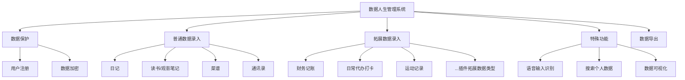
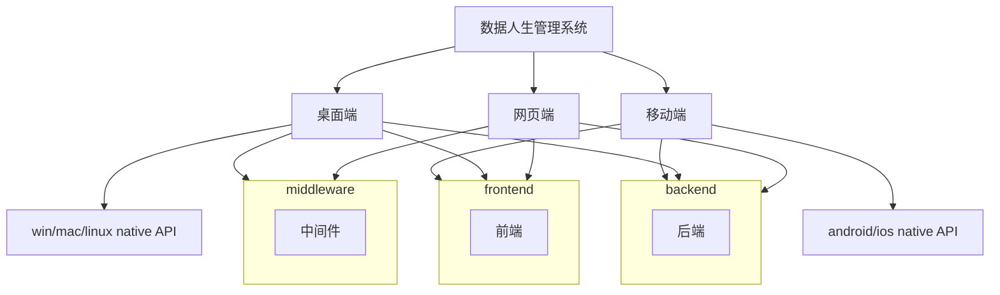
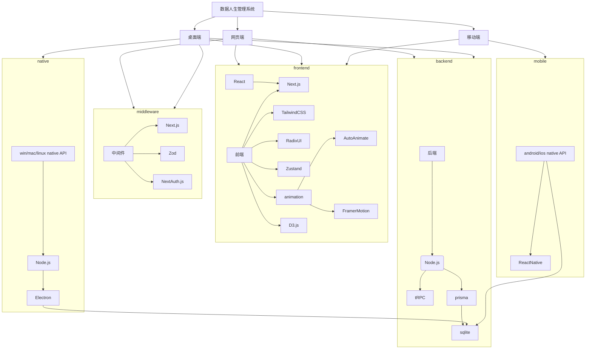

---
# try also 'default' to start simple
theme: geist
# random image from a curated Unsplash collection by Anthony
# like them? see https://unsplash.com/collections/94734566/slidev
# apply any windi css classes to the current slide
class: 'text-center'
# https://sli.dev/custom/highlighters.html
highlighter: shiki
# show line numbers in code blocks
lineNumbers: true
# some information about the slides, markdown enabled
info: |
  ## Slidev Starter Template
  Presentation slides for developers.

  Learn more at [Sli.dev](https://sli.dev)
# persist drawings in exports and build
drawings:
  persist: false
---

# 《基于Next.js和Electron的数据人生管理系统》

  
    计算机19-3班
  
  
    万旭杰 2019011789
  

---

# Introduction 引言
<h4 v-click>
近年来，随着人们生活水平的提高，个人的数据数量也在不断增加，如何合理管理自己的数据成为了一个问题。
</h4>
<h4 v-click>
本文旨在通过基于Next.js和Electron的数据人生管理系统的开发，实现对个人数据的高效管理。
</h4>

需求:

安全, 多样, 隐私, 易用, 同步等

目前同类应用难以全面满足用户有关保存用户隐私数据的各类需求。

---

### 针对这些问题，采用 Next.js 、 Electron.js 、React Native 等技术，设计并实现了数据人生管理系统。

<h4 v-click>数据人生管理系统是一个旨在安全地存储和管理个人数据的应用程序。它允许用户在多个设备上轻松浏览和编辑他们的个人数据。</h4>

<h4 v-click>数据人生管理系统使用户能够安全地存储、管理和分享数据，并为用户提供对其数据和谁可以访问数据的控制。</h4>

<h4 v-click>数据人生管理系统还提供诸如数据加密和语音输入等功能。</h4>

<h4 v-click>数据人生管理系统可以用作存储如联系信息、个人日记、私房食谱、日常待办打卡、日常记账、跑步记录、读书/观影笔记、医疗记录，以及更多不同的个人数据的安全私人数据库，还可以使用web技术的插件拓展输入各类用户的自定义输入。</h4>

---

<v-clicks class="text-lg">

- 开源/非商业闭源：✅ 商业软件有使用风险，如订阅费持续上涨（爱奇艺/Netflix），或数据受供应商审核影响丢失等（wps审核在线文档丢失）
- 数据安全性：✅ 若数据为明文存储则数据泄露风险高，数据安全性较低
- 数据修改响应速度快：✅ 指数据更改生效到UI呈现时间长短
- 数据隐私性：✅ 指数据存储位置是否可控
- 支持插件拓展：✅ 指是否可以通过插件拓展数据存储类型
- 支持数据库导出、迁移：✅ 指是否可以将用户所存数据全部导出
- 支持多端编辑、浏览个人数据：✅ 指在多个不同的os客户端浏览编辑数据能力
- 支持markdown拓展：✅ 指是否支持markdown语法或类似使用方法
- 支持用户fork自构建版本：✅ 指用户是否可能获取完全可控的自定义化软件
- 支持在线协作❌ 指是否支持多个用户同时编辑对应数据

</v-clicks>

---

| 功能/Features              | 数据人生管理系统 |
| -------------------------- |:---------------- |
| 开源/非商业闭源            | ✅               |
| 数据安全性                 | ✅               |
| 数据修改响应速度快                 | ✅               |
| 数据隐私性                 | ✅               |
| 支持插件拓展               | ✅               |
| 支持数据库导出、迁移       | ✅               |
| 支持多端编辑、浏览个人数据 | ✅               |
| 支持markdown拓展           | ✅               |

---

| 功能/Features              | 数据人生管理系统 |
| -------------------------- |:---------------- |
| 支持用户fork自构建版本     | ✅               |
| 支持在线协作               | ❌               |

---

# 国内外研究现状

 
类似数据人生管理系统的软件为知识库管理系统，知识库管理系统由如下四部分就组成[1]。

<v-clicks>

1. 1.知识库使用关系型数据库来存放知识,包括事实与规则。
2. 2.搜索模块实现知识库和推理机之间的知识搜索和与传递。
3. 3.查询模块实现推理机对知识库的知识查询。
4. 4.一致性、完整性检查模块在知识库中的知识发生变动时对知识库中的知识进行一致性、完整性检查。

</v-clicks>

 
[1]: 许诘. 试论知识库与知识库管理系统的关系[J]. 武汉工业学院学报, 2004(04): 51-54.

---

# 国内外研究现状

<v-clicks>

#### 国内软件主要有：语雀、石墨文档、飞书知识库、Obsidian等
#### 国外商用软件主要有：Notion，开源软件主要有：Affine

</v-clicks>

---

# 语雀

<v-clicks>

语雀是一款团队协作知识管理工具，它可以帮助团队成员共享、整理、组织以及查找信息。语雀提供了丰富的功能，例如文档编写、团队协作、任务管理、项目管理、文件存储等。

语雀的特点是简单易用，不需要任何技术基础即可上手。语雀采用了类似于Markdown的语法，使得用户可以快速编写高质量的文档。语雀还提供了丰富的团队协作功能，团队成员可以共同完成文档的编写、评论、修订等任务。

另外，语雀还支持移动端使用，团队成员可以通过语雀的移动端应用随时随地管理任务、项目和文档。语雀提供了丰富的API，团队可以通过语雀的API与其他系统进行整合，从而提高团队的工作效率。

总之，语雀是一款十分优秀的团队协作知识管理工具，它可以帮助团队成员快速、高效地管理、共享信息。语雀的易用性、功能丰富、安全性高等特点，使得它成为了越来越多团队选择的知识管理工具。

</v-clicks>

---

| 功能/Features            | 数据人生管理系统 | 语雀 | 石墨文档 | 飞书知识库 | Obsidian |
| ------------------------ |:---------------- | ---- | -------- | ---------- | -------- |
| 开源/非商业闭源          | ✅               | ❌   | ❌       | ❌         | ❌       |
| 数据安全性               | ✅               | ✅   | ✅       | ✅         | ❌       |
| 数据隐私性               | ✅               | ❌   | ❌       | ❌         | ✅       |
| 数据修改响应速度快       |   ✅               |   ❌   |   ❌       |     ❌       |    ✅      |
| 支持插件拓展特殊数据     | ✅               | ❌   | ❌       | ❌         | ✅       |
| 支持数据库离线导出、迁移 | ✅               | ❌   | ❌       | ❌         | ✅       |
| 支持多端同步             | ✅               | ✅   | ✅       | ✅         | ✅       |
| 支持markdown拓展         | ✅               | ❌   | ❌       | ❌         | ✅       |

---

| 功能/Features            | 数据人生管理系统 | 语雀 | 石墨文档 | 飞书知识库 | Obsidian |
| ------------------------ |:---------------- | ---- | -------- | ---------- | -------- |
| 支持用户fork自构建版本   | ✅               | ❌   | ❌       | ❌         | ❌       |
| 支持在线协作             | ❌               | ✅   | ✅       | ✅         | ❌       |

---

# Notion

<v-clicks>

- Notion是一款功能强大且易用的知识管理工具。它可以帮助用户组织、储存和共享信息。该产品拥有灵活的笔记系统，可以方便地整理文字、图片、链接等内容。
- Notion的核心优势是灵活性和适用性。该产品的高度自定义的结构可以适应各种需求，可以用作任务管理工具，知识库，文档管理系统，也可以是个人笔记应用。Notion同时支持团队合作和个人使用，可以与团队共享任务和文件，并可以在团队中评论和协作。

- Notion拥有强大的搜索功能，可以轻松检索内容，并具有良好的数据可视化功能，便于对信息进行分析和总结。此外，Notion还支持数据导入和导出，可以方便地与其他应用程序或服务集成，提高工作效率。

- 总体来说，Notion是一款优秀的组织和管理知识和任务的工具，具有高度灵活性，适用性强，同时也具有协作和沟通的功能，适合各种用户和行业需求。使用Notion，用户可以更高效地管理工作内容，提高工作效率，并为团队带来更好的协作体验。

</v-clicks>

---

| 功能/Features            | 数据人生管理系统 | Notion | Affine |
|:------------------------ |:----------------:| ------ | ------ |
| 开源/非商业闭源          |        ✅        | ❌     | ✅     |
| 数据安全性               |        ✅        | ❌     | ❌     |
| 数据隐私性               |        ✅        | ✅     | ✅     |
| 数据修改响应速度快       |          ✅        |  ❌      |   ❌     |
| 支持插件拓展特殊数据     |        ✅        | ✅     | ❌     |
| 支持数据库离线导出、迁移 |        ✅        | ✅     | ✅     |
| 支持多端同步             |        ✅        | ✅     | ❌     |
| 支持markdown拓展         |        ✅        | ✅     | ✅     |

---

| 功能/Features            | 数据人生管理系统 | Notion | Affine |
|:------------------------ |:----------------:| ------ | ------ |
| 支持用户fork自构建版本   |        ✅        | ❌     | ✅     |
| 支持在线协作             |        ❌        | ✅     | ✅     |

---

# 需求分析
对系统进行需求分析是开发数据人生管理系统的必要前提，需求分析是指根据数据人生管理的相关需求对整个系统的功能以及性能等进行分析，为系统的设计和开发奠定基础。

本章将开展对数据人生管理系统的需求分析。

---

## 功能性需求主要分为五大部分:

<v-clicks>

- 普通数据录入
- 特殊数据录入
- 数据保护
- 特殊功能
- 数据导出

</v-clicks>

---

---

## 普通数据录入
普通数据录入需求主要有:
- 通讯录
- 日记
- 菜谱
- 读书/观影笔记
- 医疗记录

---

## 特殊数据录入
特殊数据录入需求主要有:
- 日常待办打卡
- 记账
- 运动记录
- 插件拓展数据类型

---

## 数据保护

用户注册功能主要是为了保护系统被随意的访问

用户登录功能主要是为了系统根据不同用户角色来决定可查看的内容范围

数据加密功能主要是为了系统数据导出时被查看

---

## 特殊功能
语音输入识别：流行软件如微信、QQ、讯飞输入法等都有语音识别功能，此功能可以提升数据输入便利性与多样性

搜索个人信息：快速检索个人数据

数据可视化：可以直观地统计个人的多种数据，如：阅读、运动、记账等。

---

## 数据导出
将用户的全部个人数据导出打包，方便用户迁移数据，或者备份数据

---

# 研究方案或设计方案

## Tech stack 技术栈总览

<v-clicks>

数据人生管理系统包含三端：网页端、桌面端、移动端

前端框架、后端框架、前后端交互技术、数据库。

本系统采用 Next.js 作为前端框架，Next.js 框架负责生成前端页面相关代码，通过Nginx服务器发送给用户浏览器；后端服务器在接收到用户请求后对数据库进行创建、读取、修改和删除操作；用户浏览器使用 fetch 前后端交互技术与后端服务器通信并根据响应结果动态更新页面。

</v-clicks>

---
layout: center
---

---

<v-clicks>

#### 在网页端，前端使用了基于React的Next.js全栈框架，TailwindCSS、RadixUI作为前端基础样式库，Zustand作为网页状态管理技术选择，并使用了包括AutoAnimate和FramerMotion动画库以优化UX体验。后端使用Node.js、tRPC作为主要后端并检查前后端api端口数据是否类型一致、prisma，prisma作为ORM连接sqlite数据库进行数据操纵。使用Next.js、Zod、NextAuth.js等技术作为中间件。

#### 桌面端也使用了类似的前端和后端技术，并且还通过Node.js、Electron技术来使用win/mac/linux的本地API。

#### 移动端主要复用了前端部分代码，同时也使用了ReactNative技术调用android/ios的本地API，对sqlite数据库进行复用。

</v-clicks>

---

# 前端

### React
React.js是一个用于构建用户界面的JavaScript库。React允许开发者创建可重复使用的UI组件，使其更容易以一种有组织和高效的方式建立复杂的用户界面。它使用一个虚拟DOM（文档对象模型）来有效地更新用户界面，与传统的DOM操作相比，性能得到了提高。它还能很好地与其他JavaScript库和工具集成，使其成为构建可扩展的动态网络应用的热门选择。
### 基于React的Next.js 框架在软件开发中的应用

Next.js是 Vercel公司基于React于2018年开源的fullstack web框架用于构建高性能的Web应用。它针对于服务端渲染（SSR）和静态导出（static export）提供了一整套解决方案，帮助开发者构建快速，安全，可靠的Web应用。

Next.js的显著有点是对服务端ssr的全面支持。ssr是一种Web应用的技术，可以在服务器端构建页面，从而有效地提高页面的加载速度。Next.js不仅支持ssr，而且还帮助开发者解决了服务端渲染带来的一系列问题，例如路由，数据请求和代码分割等。

---

# 样式库
### TailwindCSS
Tailwind CSS是一个高度可定制的低级别的CSS框架，它提供了一套用于构建自定义用户界面的实用类。
### RadixUI
Radix UI是一个开源的UI组件库，用于构建高质量的、可访问的设计系统和网络应用。
### d3.js
D3.js的全称是叫做data driven documents，直译为数据驱动文档，它是用于数据驱动SVG图形编辑和交互制作的基础类库。D3.js封装了DOM操作方法，并结合一套数据集和操作集，以提供一种基于数据驱动实现图表的方法。D3.js是目 前实现数据可视化非常流行的一个工具。

---

# 后端

### Node.js

Node.js是一个强大的JavaScript运行时，用于构建可扩展的网络应用。它将浏览器中的js带入后端。

### tRPC
tRPC是一个JavaScript后端开发库，使开发人员能够创建和消费完全类型安全的API，而不需要模式或代码生成。随着TypeScript和静态类型化在Web开发中变得越来越重要，tRPC提供了一个静态类型化API端点的解决方案，并在客户端和服务器之间共享这些类型。与传统的RESTful API或GraphQL不同，tRPC利用TypeScript允许开发者在他们的客户端和服务器之间直接共享类型，而不需要生成代码。通过使用tRPC，开发者可以确保他们的API端点是类型安全的，并避免运行时的错误。

---

### sqlite

SQLite 是一个使用 C 语言开发的轻量级嵌入式数据库，它的体积小，集成度高，同时还拥有无需配置，可靠安全等特性。

SQLite 是一个紧凑的库。启用所有功能后，库大小可以小于 750KiB。即使在低内存环境中，性能通常也相当不错。

根据使用方式，SQLite 可能比直接文件系统 I/O 更快。

SQLite 能直接嵌入到应用程序中，用户不需要进行安装，也不需要开启单独的系统进程来进行支持，开发者在使用时，将 SQLite 源码和相关库文件导入到项目中，就可以实现对数据库的相关操作，同时它还提供了丰富的 API 接口。

数据人生管理系统中的大部分事务为 INSERT 与 UPDATE，SQLite 官方网站公布的结果显示，对一个有索引的表执行 25000 次 INSERT，SQLite2.7.6 异步版本耗时 1.402 秒，PostgreSQL 与 MySQL 则分别耗时 8.175 秒、3.197 秒，这种情况下 SQLite 的性能远高于 PostgreSQL 与 MySQL。SQLite 在大数据量的情况下表现较差，但是个人数据管理系统一般情况下数据量不超过5 万，而SQLite 在100万数据量以下时表现不错。因此，SQLite 数据库能够满足本系统的需求。

---

### prisma

Javascript的ORM开源软件。Prisma 内部集成了SQLite3操作api，可以让开发人员直接在 JavaScript 中对数据库进行使用。

ORM层屏蔽掉了底层数据库细节，理论上一切通过SQL语句能做到的功能，ORM 都能做到。

---

---

---
# 毕业设计成果

实现安全地存储和管理个人数据、提供诸如数据加密和数据访问控制等功能、允许用户在多个设备上轻松浏览和编辑他们的个人数据、为用户提供对其数据和谁可以访问数据的控制的安全私人数据库应用程序。

成果将全部开源至GitHub[https://github.com/dicarbene]

---
# 时间安排

<v-clicks>

### [12-1月]选题与初步研究
### [1-2月]开题报告撰写与开发技术调研
### [3-4月]系统各端功能实现
### [5月]系统测试与论文撰写
### [~6月初]论文修改与答辩准备

</v-clicks>

---
layout: center
---

# 感谢各位老师的聆听！望斧正不足之处。